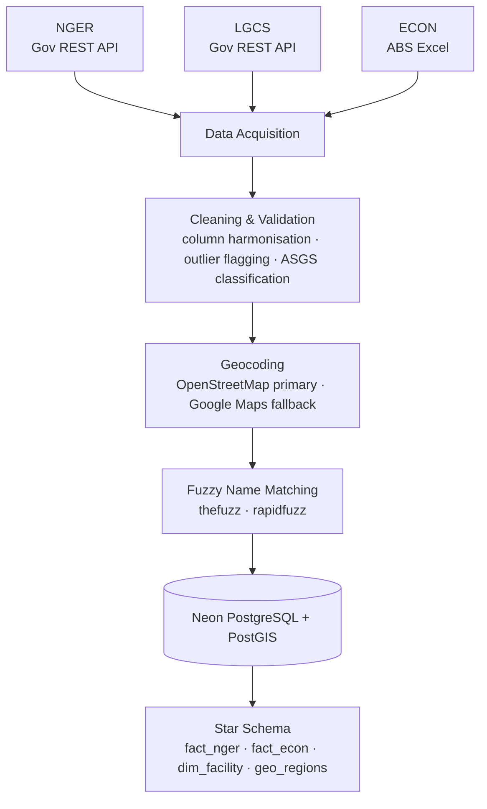
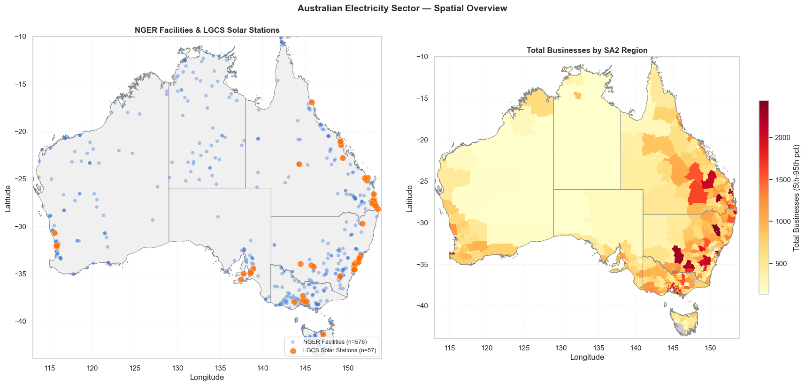
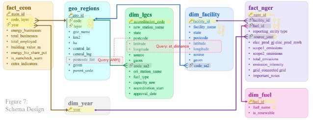

# Australian Energy ETL Pipeline

> **Part 1 of the Australian Energy Data Platform** — the batch foundation.
> ➊ Batch ETL (this repo) → **Neon PostgreSQL + PostGIS** → [➋ Real-time streaming dashboard](../energy-streaming-dashboard)
>
> This pipeline builds the geospatial serving layer (`dim_facility`, `geo_regions`) that the streaming dashboard consumes for live map enrichment.

A multi-source geospatial ETL pipeline that ingests, cleans, geocodes, and stores Australian energy and economic data into a cloud PostgreSQL database.

---

## What It Does

The pipeline pulls data from three government sources, resolves inconsistencies across them, geocodes thousands of energy facilities, and loads everything into a star-schema relational database ready for downstream analysis.

---

## Pipeline



---

## Sample Output

Spatial overview from **Section 3-7** of `energy-etl-pipeline.ipynb` — validates geocoded facility locations against ECON regional data after the ETL load:



*Left: 1,108 NGER facilities and 38 LGCS solar stations geocoded via OpenStreetMap + Google Maps fallback. Right: total businesses by SA2 region (choropleth, 5th–95th percentile scale) joined from `geo_regions` and `fact_econ`.*

---

## Data Sources

- **NGER** (National Greenhouse and Energy Reporting) — facility-level emissions and electricity production, 2014–2023, via Australian Government REST API
- **LGCS** (Large-scale Generation Certificate Scheme) — accredited renewable power stations, via REST API
- **ECON** (ABS Economic Census) — regional business activity data, via ABS Excel files

---

## Pipeline Stages

**1 · Data Acquisition** — downloads all three datasets programmatically; detects existing cached files to avoid redundant fetches; loads ASGS geospatial reference shapefiles.

**2 · Cleaning & Validation** — harmonises column names across NGER years, coalesces duplicate columns, standardises date formats, classifies ECON rows by ASGS geographic level (SA2–national), validates region codes against the ASGS reference, and flags outliers using IQR bounds (retained rather than dropped, to preserve state-level aggregates).

**3 · Geocoding** — resolves latitude/longitude for ~1,000 NGER facilities and LGCS power stations using a dual-API strategy: OpenStreetMap Nominatim as primary, Google Maps API as fallback for unresolved addresses. Fuzzy-matches inconsistent facility names across datasets using `thefuzz`/`rapidfuzz`. Results are persisted to the DB incrementally so the geocoding step is resumable.

**4 · Database Load** — writes to a Neon cloud PostgreSQL instance with PostGIS enabled. Schema follows a star/snowflake model with two fact tables (`fact_nger`, `fact_econ`), shared dimensions (`dim_year`, `dim_fuel`), and a central geographic dimension (`geo_regions`) linking facilities, power stations, and regional economic indicators:



Key design choices:

- `geo_regions.geom` stores ASGS polygon boundaries; `dim_facility` / `dim_lgcs` store point geometries for spatial joins
- `geo_regions.postcode_list` enables `ANY()` lookups to map facilities to SA2 regions without re-running spatial joins
- `st_distance` queries support proximity analysis between NGER facilities and LGCS power stations
- Composite unique constraints on `fact_nger` (`facility_id`, `fuel_id`, `source_year`) prevent duplicate loads on re-run

---

## My Contributions

Sections 1 (data acquisition), 3 (geocoding), and 4 (DB schema + ETL load). Section 2 (data cleaning) was collaborative.

---

## Tech Stack


| Category      | Tools                                                                  |
| ------------- | ---------------------------------------------------------------------- |
| Language      | Python 3.11+                                                           |
| Data          | pandas, geopandas, shapely                                             |
| Geocoding     | requests, thefuzz, rapidfuzz, Google Maps API, OpenStreetMap Nominatim |
| Database      | PostgreSQL (Neon cloud), psycopg2, PostGIS                             |
| Visualisation | matplotlib, ipyleaflet                                                 |


---

## How to Run

```bash
pip install pandas geopandas shapely psycopg2-binary requests thefuzz rapidfuzz matplotlib ipyleaflet python-dotenv
```

Create a `.env` file with your credentials (see `.env.example`):

```
NEON_HOST=...
NEON_PORT=5432
NEON_DB=neondb
NEON_USER=...
NEON_PASSWORD=...
GOOGLE_MAPS_API_KEY=...
```

Then run `energy-etl-pipeline.ipynb` top to bottom. Geocoding results are cached in the database after the first run.

---

## Notes

- ECON data for 2014–2015 is structurally absent from the ABS 2011–2024 release, not a filtering error.

---

## Related — Part 2 of the Platform

The **[Real-Time Energy Streaming Dashboard](../energy-streaming-dashboard)** is the downstream consumer of this pipeline: it queries the `dim_facility` and `geo_regions` tables built here to enrich a live MQTT stream of NEM market data on an interactive map. Together they form a batch-to-streaming data platform — this repo is the batch serving layer; the dashboard is the real-time layer.